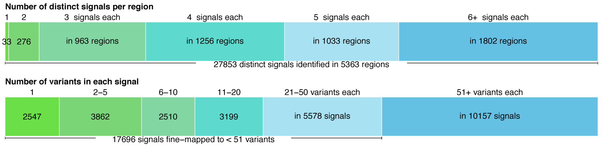

# Fine-mapping

Distinct association signals (top). A single signal at 33 regions, and two to forty signals at 5330 regions across 35 traits. Number of variants in the credible set with >= 99% posterior probability (bottom). 2547 signals were mapped to a single variant in the credible set across 35 traits.

## The fine-mapping analysis was performed with FINEMAP

## Post-processing

`filtration` directory contains the scripts used for the post-processing.

## Summary figure

To generate the figure for the fine-mapping analysis (written in `figs` directory), we used the following scripts:

1. we apply `filteration/generate_filtered_regions.sh` to compute the list of filtered regions: `filtration/filtered_regions.txt.gz`
2. [`2_parse_FINEMAP_output.R`](2_parse_FINEMAP_output.R): this script reads the full results from FINEMAP and save the relevant info in a table file.
  - [`FINEMAP_output.tsv`](FINEMAP_output.tsv): this is the parsed output.
3. [`3_plotFinemapFig.ipynb`](3_plotFinemapFig.ipynb): this R notebook generates the fine-mapping summary plot
  - [`finemap_functions.R`](finemap_functions.R): this script has helper functions.
4. [`4_plotFinemapFig.per.trait.R`](4_plotFinemapFig.per.trait.R): this R script generates the summary plot per trait.
  - The numbers in each trait-specific figure is saved in a table file, [`plotFinemapFig.per.trait.numbers.tsv`](plotFinemapFig.per.trait.numbers.tsv). We have the following columns in this table file.
    - name: the name of the phenotypes for plotting (from `commons/cascade.input.files.tsv`)
    - trait: the name of the phenotypes (for computing)
    - n_regions: number of regions
    - n_signals: number of signals
    - sr<number>: n_signal_per_region
    - ss<number>: n_snps_per_signal

The results are saved and copied to the Google Drive shared folder: https://drive.google.com/drive/folders/1i6w0qQRfrv-vEi7NIMh2yoSsCgTYtdE-

## Generate the list of fine-mapped variants

We applied additional filters on fine-mapped variants (p < 5e-9 AND posterior prob > .99) and prepared as a table.
In that table, we added variant annotation as well as the index of the region.
`filtered_hits` has the scripts used for this analysis.

## Figshare submission

[`figshare_submission`](figshare_submission) has more info.
